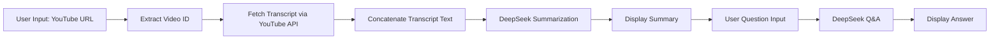

# YouTube Video Assistant (Streamlit)

A Streamlit application that summarizes YouTube video transcripts and provides interactive Q&A using DeepSeek's AI API. The app extracts transcripts via the YouTube Transcript API (with proxy support), generates concise summaries, and answers user questions based on the summary.

---


## Table of Contents
1. [Features](#features)
2. [Prerequisites](#prerequisites)
3. [Installation](#installation)
4. [Configuration](#configuration)
5. [Usage](#usage)
6. [Architecture Overview](#architecture-overview)
7. [Future Improvements](#future-improvements)
8. [License](#license)

---

## Features

- **Transcript Extraction:** Retrieve YouTube subtitles, rotating through HTTP proxies to avoid IP blocking.
- **Summarization:** Generate concise summaries (≤250 words) using DeepSeek's `deepseek-chat` model.
- **Interactive Q&A:** Answer user queries accurately based on the generated summary.
- **Session State:** Preserve the summary for seamless, multi-step interactions.

## Prerequisites

- Python 3.8 or higher
- Access to YouTube Transcript API
- DeepSeek API key


## Architecture Overview


## Installation

1. **Clone the repository**

   ```bash
   git clone https://github.com/<username>/youtube-video-assistant.git
   cd youtube-video-assistant

2. **Create and activate a virtual environment**

   ```bash
   python3 -m venv venv
   source venv/bin/activate
   ```

3. **Install dependencies**

   ```bash
   pip install -r requirements.txt
   ```

## Configuration

1. **Streamlit Secrets**

   Add your DeepSeek API key to `.streamlit/secrets.toml`:

   ```toml
   [secrets]
   DEEPSEEK_API_KEY = "<your_api_key>"
   ```

2. **Proxy Credentials**

   Ensure `PROXY_USER` and `PROXY_PASS` in `main.py` match your proxy service credentials.

## Usage

Run the application locally:

```bash
streamlit run main.py
```

1. Enter a YouTube video URL.
2. Click **Get Detailed Notes** to extract and summarize the transcript.
3. Once the summary appears, enter your question in the Q\&A section.
4. Click **Submit Question** to receive an AI-generated answer.


* **Proxy Pool:** Randomly cycles through predefined HTTP proxies to prevent request blocking.
* **DeepSeek Client:** OpenAI-compatible client configured with base URL `https://api.deepseek.com`.

## Future Improvements

* Implement retry logic with exponential backoff for proxy failures.
* Offer multiple summary lengths or customizable styles.
* Integrate additional AI models (e.g., OpenAI GPT-4, BERT) for enhanced analysis.
* Containerize with Docker and deploy on Streamlit Cloud or similar platforms.

## License

This project is licensed under the MIT License. See the [LICENSE](LICENSE) file for details.

```
```
